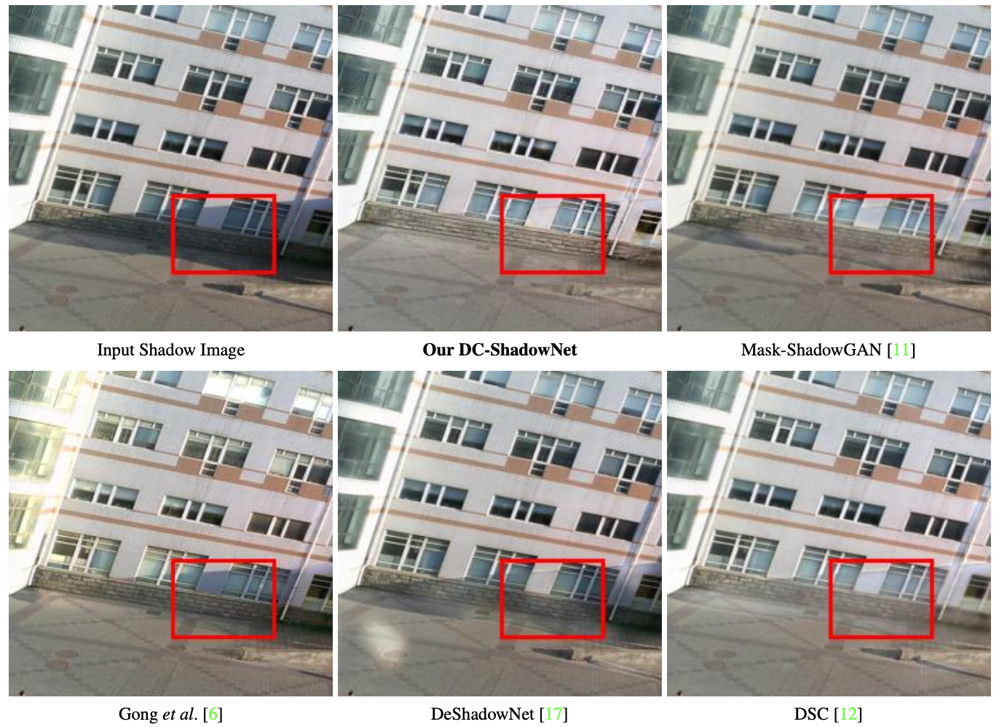
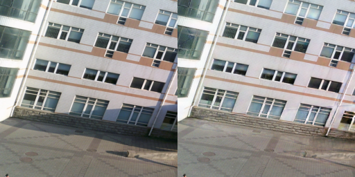
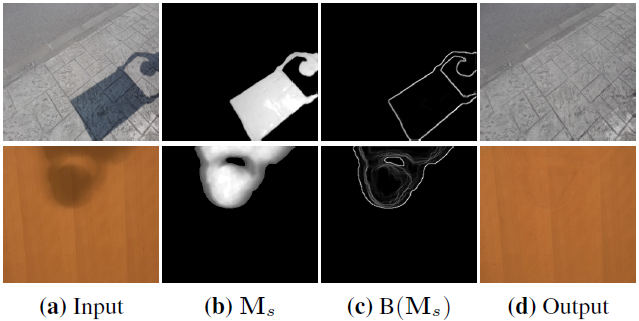

# DC-ShadowNet

## Introduction
This is an implementation of the following paper
**DC-ShadowNet: Single-Image Hard and Soft Shadow Removal Using
Unsupervised Domain-Classifier Guided Network. (ICCV'2021)** 
Yeying Jin, [Aashish Sharma](https://aasharma90.github.io/) and [Robby T. Tan](https://tanrobby.github.io/pub.html)

### Abstract
Shadow removal from a single image is generally still an open problem.
Most existing learning-based methods use supervised learning and require a large number of paired images (shadow and corresponding non-shadow images) for training.
A recent unsupervised method, Mask-ShadowGAN, addresses this limitation. 
However, it requires a binary mask to represent shadow regions, making it inapplicable to soft shadows. 
To address the problem, in this paper, we propose an unsupervised domain-classifier guided shadow removal network, DC-ShadowNet. 
Specifically, we propose to integrate a shadow/shadow-free domain classifier into a generator and its discriminator, enabling them to focus on shadow regions.
To train our network, we introduce novel losses based on physics-based shadow-free chromaticity, shadow-robust perceptual features, and boundary smoothness. 
Moreover, we show that our unsupervised network can be used for test-time training that further improves the results. 
Our experiments show that all these novel components allow our method to handle soft shadows, and also to perform better on hard shadows both quantitatively and qualitatively than the existing state-of-the-art shadow removal methods.


Overview of the proposed method:
<p align="center"></p>

### Datasets
1. SRD (please download [train](https://drive.google.com/file/d/1W8vBRJYDG9imMgr9I2XaA13tlFIEHOjS/view) [BaiduNetdisk](https://pan.baidu.com/s/1mj3BoRQ) and [test from the authors](http://www.shengfenghe.com/publications/)).
[Extracted Shadow Masks in the SRD Dataset](https://github.com/vinthony/ghost-free-shadow-removal)

2. [AISTD](https://www3.cs.stonybrook.edu/~cvl/projects/SID/index.html) 

3. [LRSS: Soft Shadow Dataset](http://visual.cs.ucl.ac.uk/pubs/softshadows/)

4. [ISTD](https://github.com/DeepInsight-PCALab/ST-CGAN) 

5. [USR: Unpaired Shadow Removal Dataset](https://drive.google.com/file/d/1PPAX0W4eyfn1cUrb2aBefnbrmhB1htoJ/view)

### Shadow Removal Results:
1. SDR Dataset
[DC-ShadowNet Results](https://www.dropbox.com/sh/jhm4kxvq9apubq9/AAB5BickFfGhunK5ezJK0R0_a?dl=0),
[All Results](https://www.dropbox.com/sh/kg87bt5tcmi535n/AACrGNvLgpWd-UTs6NWep9MLa?dl=0)
 

2. AISTD Dataset
[DC-ShadowNet Results](https://www.dropbox.com/sh/14ubek5xe4t5v1l/AABGZYLgp5V4RkYvqGL2NB8ja?dl=0),
[All Results](https://www.dropbox.com/sh/foqmi8olum6n3qz/AADX3aQ4yzWvKHh4wtAF6YREa?dl=0)

3. LRSS Soft Shadow Dataset
[DC-ShadowNet Results](https://www.dropbox.com/sh/i9rto8h1shbc315/AADa6kvxwtUP8EKju2jSKxn2a?dl=0),
[All Results](https://www.dropbox.com/sh/ryku9yr1j4u4898/AABC2gPoM9scASHZ0N6SmwBDa?dl=0)

4. ISTD Dataset
[DC-ShadowNet Results](https://www.dropbox.com/sh/8hiii6w3kpd3ypf/AACsv7btBXyK5imdqEV_DgDra?dl=0)

5. USR Dataset
[DC-ShadowNet Results](https://www.dropbox.com/sh/m9c8gc5ymbdcahl/AADphRwZLoH2GJENcnSptnWaa?dl=0)

### Evaluation
The default root mean squared error (RMSE) evaluation code used by all methods (including ours) actually computes mean absolute error (MAE). 

1. The faster version [MAE evaluation code](https://www.dropbox.com/sh/nva9ddquvgogb5n/AABOHrWx9whMXeItcZfODe9ia?dl=0)
2. The original version [MAE evaluation code](https://drive.google.com/file/d/1-lG8nAJbWajAC4xopx7hGPKbuwYRw4x-/view)

1.1 SRD Dataset, set the paths of the shadow removal result and the dataset in demo_srd_release.m and then run it.

Get the following Table 1 in the main paper on the SRD dataset (size: 256x256).

| Method | Training | All | Shadow | Non-Shadow |
|------------------|----------|----------|------|------|
| **DC-ShadowNet** | Unpaired | **4.66** | 7.70 | 3.39 |
| Mask-ShadowGAN | Unpaired | 6.40 | 11.46 | 4.29 |
| DSC | Paired | 4.86 | 8.81 | **3.23** |
| DeShadowNet | Paired | 5.11 | **3.57** | 8.82 |
| Gong | Prior | 12.35 | 25.43 | 6.91 |
| Input Image | N/A | 13.77 | 37.40 | 3.96 |

1.2 AISTD Dataset, set the paths of the shadow removal result and the dataset in demo_aistd_release.m and then run it.

Get the following Table 2 in the main paper on the AISTD dataset (size: 256x256).
| Method | Training | All | Shadow | Non-Shadow |
|------------------|----------|---------|----------|-----|
| **DC-ShadowNet** | Unpaired | **4.6** | **10.3** | 3.5 |

1.3 LRSS Soft Shadow Dataset, set the paths of the shadow removal result and the dataset in demo_lrss_release.m and then run it.

Get the following Table 3 in the main paper on the LRSS dataset (size: 256x256).
| Method | Training | All | 
|------------------|----------|----------|
| **DC-ShadowNet** | Unpaired | **3.48** |
| Input Image | N/A | 12.26 |

## Pre-trained Model
1. Download the [pre-trained SRD model](https://www.dropbox.com/s/y7247t2pbozhlo7/SRD_params_0500000.pt?dl=0), put in results/SRD/model/

2. Download the [pre-trained AISTD model](https://www.dropbox.com/s/nv7i4ofal9s9wud/AISTD_params_0500000.pt?dl=0), put in results/AISTD/model/ 

3. Download the [pre-trained ISTD model](https://www.dropbox.com/s/0rro00nqg7tbds3/ISTD_params_0600000.pt?dl=0), put in results/ISTD/model/

### Test
python main_test.py --dataset SRD --datasetpath YOURPATH --phase test

Results: results/SRD/iteration/outputB

rename to the original name, please change the suffix of test images accordingly (.jpg OR .png)

python main_test_original_name.py --dataset SRD --datasetpath YOURPATH --phase test --im_suf_A .jpg



### Train
1. Implement the papers [On the removal of shadows from images (TPAMI,05)](https://www.cs.sfu.ca/~mark/ftp/Pami06/pami06.pdf) and [Recovery of Chromaticity Image Free from Shadows via Illumination Invariance (ICCV,03)](https://www.cs.sfu.ca/~mark/ftp/Iccv03ColorWkshp/iccv03wkshp.pdf)
 

### Directory
2. Download Datasets and run 1, get the Shadow-Free Chromaticity Maps after Illumination Compensation, and put them in the trainC folder, you should see the following directory structure. 
```
${DC-ShadowNet-Hard-and-Soft-Shadow-Removal}
|-- dataset
    |-- SRD
      |-- trainA ## Shadow 
      |-- trainB ## Shadow-free 
      |-- trainC ## Shadow-Free Chromaticity Maps after Illumination Compensation
      |-- testA  ## Shadow 
      |-- testB  ## Shadow-free 
...
```

2. python main.py --dataset SRD --phase train

## Shadow-Robust Feature
 
Get the following Figure 5 in the main paper, VGG feature visualization code is in feature_release folder,

python test_VGGfeatures.py

Results: ./results_VGGfeatures/shadow_VGGfeatures/layernumber/imagenumber/visual_featurenumber_RMSE.jpg


## Boundary Smoothness Loss
 
Get the following Figure 8 in the main paper, shadow boundary code is in boundary_smooth folder,

run getRTVdenMask.m

Results: input_softmask_boundary.jpg

### Citation
Please kindly cite our paper if you are using our codes:
