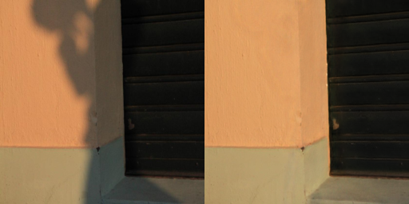
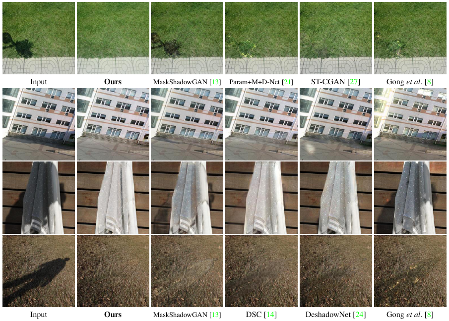
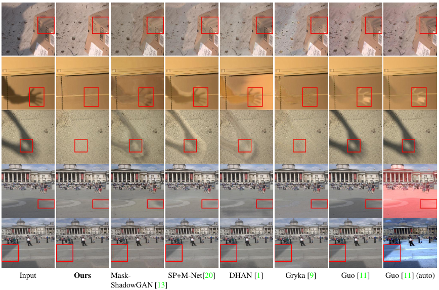
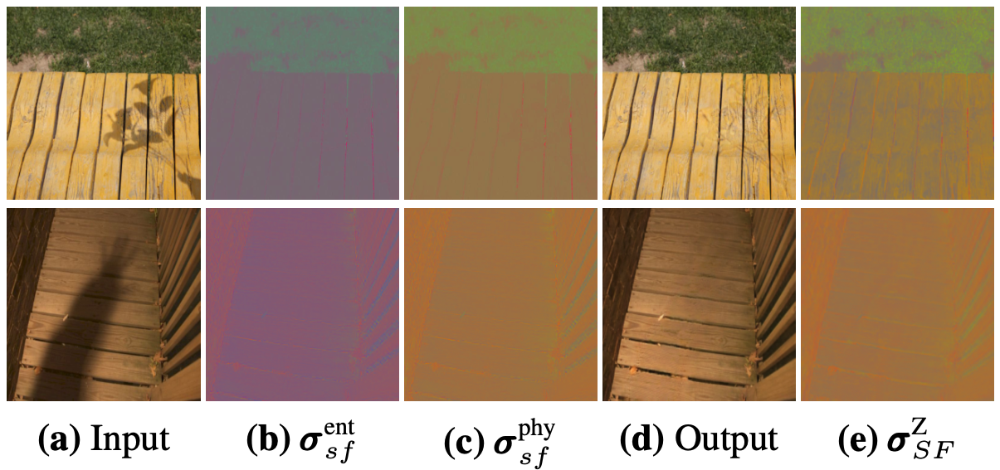

# DC-ShadowNet (ICCV'2021)

## Introduction
> [DC-ShadowNet: Single-Image Hard and Soft Shadow Removal Using
Unsupervised Domain-Classifier Guided Network](https://arxiv.org/abs/2207.10434)<br>
>  International Conference on Computer Vision (ICCV'2021)

[Yeying Jin](https://jinyeying.github.io/), [Aashish Sharma](https://aasharma90.github.io/) and [Robby T. Tan](https://tanrobby.github.io/pub.html)

[](https://arxiv.org/abs/2207.10434)
[[Paper]](https://openaccess.thecvf.com/content/ICCV2021/papers/Jin_DC-ShadowNet_Single-Image_Hard_and_Soft_Shadow_Removal_Using_Unsupervised_Domain-Classifier_ICCV_2021_paper.pdf) 
[[Supplementary]](https://openaccess.thecvf.com/content/ICCV2021/supplemental/Jin_DC-ShadowNet_Single-Image_Hard_ICCV_2021_supplemental.pdf) 
[[Poster]](poster_slides/DC-ShadowNet_poster.pdf)
[[Slides]](poster_slides/DC-ShadowNet_slides.pdf) 
[[Video]](https://www.bilibili.com/video/BV12e411H7bx/?share_source=copy_web&vd_source=2da049ce4677af057256ebc4a00a8292) 
[[Zhihu]](https://zhuanlan.zhihu.com/p/474123242)

[](https://paperswithcode.com/sota/shadow-removal-on-srd?p=dc-shadownet-single-image-hard-and-soft-1)
[](https://paperswithcode.com/sota/shadow-removal-on-istd?p=dc-shadownet-single-image-hard-and-soft-1)

## Prerequisites
```
git clone https://github.com/jinyeying/DC-ShadowNet-Hard-and-Soft-Shadow-Removal.git
cd DC-ShadowNet-Hard-and-Soft-Shadow-Removal/
conda create -n shadow python=3.7
conda activate shadow
conda install pytorch=1.10.2 torchvision torchaudio cudatoolkit=11.3 -c pytorch
python3 -m pip install -r requirements.txt
```

## Datasets
1. SRD [Train](https://drive.google.com/file/d/1W8vBRJYDG9imMgr9I2XaA13tlFIEHOjS/view)|[BaiduPan](https://pan.baidu.com/s/1mj3BoRQ), [Test](https://drive.google.com/file/d/1GTi4BmQ0SJ7diDMmf-b7x2VismmXtfTo/view).
[Shadow Masks](https://github.com/vinthony/ghost-free-shadow-removal)

2. AISTD|ISTD+ [[link]](https://github.com/cvlab-stonybrook/SID)

3. ISTD [[link]](https://drive.google.com/file/d/1I0qw-65KBA6np8vIZzO6oeiOvcDBttAY/view)

4. USR: Unpaired Shadow Removal Dataset [[link]](https://drive.google.com/file/d/1PPAX0W4eyfn1cUrb2aBefnbrmhB1htoJ/view)

5. LRSS: Soft Shadow Dataset [[link]](http://visual.cs.ucl.ac.uk/pubs/softshadows/)<br>
   The LRSS dataset contains 134 shadow images (62 pairs of shadow and shadow-free images). <br>
   We use 34 pairs for testing and 100 shadow images for training. <br>
   For shadow-free training images, 28 from LRSS and 72 randomly selected from the USR dataset.<br>
   |[[Dropbox]](https://www.dropbox.com/scl/fo/3dt75e23riozwa6uczeqd/ABNkIZKaP8jFarfNrUUjpVg?rlkey=eyfjn7dhd9pbz6rh247ylbt0c&st=01lh80r8&dl=0)|[[BaiduPan(code:t9c7)]](https://pan.baidu.com/s/1c_VsDVC92WnvI92v8cldsg?pwd=t9c7)|
   | :-----------: | :-----------: |


## Pre-trained Models and Shadow Removal Results: [[Dropbox]](https://www.dropbox.com/sh/346iirg55e1qnir/AADqxEu8vyj4KfKR0wOfELjKa?dl=0) | [[BaiduPan(code:gr59)]](https://pan.baidu.com/s/1EyYvjeu6AnJuY3wEuJS74A?pwd=gr59) 
| Dataset  | Model Dropbox | Model BaiduPan | Model Put in Path| Results Dropbox | Results BaiduPan |
| :----: | :-----------: | :----------: |:---------------: |  :----------: |:---------------: | 
| SRD | [[Dropbox]](https://www.dropbox.com/scl/fi/icj273vu98w1l9zzwjxt7/SRD_params_0500000.pt?rlkey=6jzx33gwat7t4fv30spw3c0za&dl=0) |[[BaiduPan(code:zhd2)]](https://pan.baidu.com/s/1CV1wQkSMR9OOw9ROAdY-pg?pwd=zhd2) |`results/SRD/model/`| [[Dropbox]](https://www.dropbox.com/s/x5qvbe5gpergqqp/DC-ShadowNet_SRD.zip?dl=0) | [[BaiduPan(code:28bv)]](https://pan.baidu.com/s/1T-KK7iWAyRzBgGg9WUAcAg?pwd=28bv) |
| AISTD/ISTD+ | [[Dropbox]](https://www.dropbox.com/scl/fi/k3suqb1ikis4mm6ok6ky4/AISTD_params_0500000.pt?rlkey=e9iylpj6vcpxfcjcud72gw1id&dl=0) |[[BaiduPan(code:cfn9)]](https://pan.baidu.com/s/1wuAZ9ACx6w_2v2MbzrYY7Q?pwd=cfn9)  |`results/AISTD/model/`| [[Dropbox]](https://www.dropbox.com/s/uacmjnnmzfldh10/DC-ShadowNet_AISTD.zip?dl=0) | [[BaiduPan(code:3waf)]](https://pan.baidu.com/s/1BdBW2H3YAEJdPyuUYGiiuQ?pwd=3waf) |
| ISTD | [[Dropbox]](https://www.dropbox.com/scl/fi/jgdcftwxpvnwxegawbrqx/ISTD_params_0600000.pt?rlkey=pdylqoxxx0krjza4a6uwzgd85&dl=0) |[[BaiduPan(code:b8o0)]](https://pan.baidu.com/s/1qtC0PtCqS5drYRi1-Ta2gw?pwd=b8o0) |`results/ISTD/model/`| [[Dropbox]](https://www.dropbox.com/s/vlo9ng6hufyxuxl/DC-ShadowNet_ISTD.zip?dl=0) |[BaiduPan(code:hh4n)](https://pan.baidu.com/s/1mX-bjzSbzojWAhy54JvmTA?pwd=hh4n) |
| USR  | [[Dropbox]](https://www.dropbox.com/scl/fi/kcj4m88ha3razxqx1c7m6/USR_params_0600000.pt?rlkey=f14177w0udgh07q669q8shj1a&dl=0) | [BaiduPan(code:e0a8)](https://pan.baidu.com/s/16MYozQ3QYT3bAhE-eTehXA?pwd=e0a8)  |`results/USR/model/`| [[Dropbox]](https://www.dropbox.com/s/ybmwxtmo7cdljyz/DC-ShadowNet_USR.zip?dl=0) | [[BaiduPan(code:u7ec)]](https://pan.baidu.com/s/1GINuAY3V39TodVdrH3mVlA?pwd=u7ec) |
| LRSS  | - | - | -| [[Dropbox]](https://www.dropbox.com/s/wi6g12gr1z0xsqi/DC-ShadowNet_Soft.zip?dl=0) | [[BaiduPan(code:bbns)]](https://pan.baidu.com/s/1yLxFKLH7QJr_f75ITUCRMQ?pwd=bbns) |

## Single Image Test
1. Download the pre-trained SRD model [[Dropbox]](https://www.dropbox.com/scl/fi/icj273vu98w1l9zzwjxt7/SRD_params_0500000.pt?rlkey=6jzx33gwat7t4fv30spw3c0za&dl=0) | [[BaiduPan(code:zhd2)]](https://pan.baidu.com/s/1CV1wQkSMR9OOw9ROAdY-pg?pwd=zhd2), put in `results/SRD/model/`
2. Put the test images in `test_input`, results in: `results/output/` <br>
```
${DC-ShadowNet-Hard-and-Soft-Shadow-Removal}
|-- test_input           ## Shadow
|-- results
    |-- output           ## Results
```

```
CUDA_VISIBLE_DEVICES='0' python main_test_single.py
```
<p align="left">
    
</p>

## Dataset Test
1. Download the pre-trained models (the table above) and place them in the `results/dataset/model/` 
2. For the SRD test dataset `/dataset/SRD/testA/`, results in: `results/SRD/500000(iteration)/outputB/`
```
${DC-ShadowNet-Hard-and-Soft-Shadow-Removal}
|-- dataset
    |-- SRD
      |-- testA           ## Shadow
    |-- AISTD
      |-- testA           ## Shadow
    |-- USR
      |-- testA           ## Shadow
|-- results
    |-- SRD
      |-- model           ## SRD_params_0500000.pt
      |-- 500000/outputB/ ## Results
    |-- AISTD
      |-- model           ## AISTD_params_0500000.pt
      |-- 500000/outputB/ ## Results
    |-- ISTD
      |-- model           ## ISTD_params_0600000.pt
      |-- 600000/outputB/ ## Results
    |-- USR
      |-- model           ## USR_params_0600000.pt
      |-- 600000/outputB/ ## Results
```

```
CUDA_VISIBLE_DEVICES='0' python main_test.py --dataset SRD --datasetpath /home1/yeying/DC-ShadowNet-Hard-and-Soft-Shadow-Removal/dataset/SRD --use_original_name True --im_suf_A .jpg
```
```
CUDA_VISIBLE_DEVICES='0' python main_test.py --dataset AISTD --datasetpath /home1/yeying/DC-ShadowNet-Hard-and-Soft-Shadow-Removal/dataset/AISTD --use_original_name True --im_suf_A .png
```
```
CUDA_VISIBLE_DEVICES='0' python main_test.py --dataset ISTD --datasetpath /home1/yeying/DC-ShadowNet-Hard-and-Soft-Shadow-Removal/dataset/ISTD --use_original_name True --im_suf_A .png
```
```
CUDA_VISIBLE_DEVICES='0' python main_test.py --dataset USR --datasetpath /home1/yeying/DC-ShadowNet-Hard-and-Soft-Shadow-Removal/dataset/USR --use_original_name True --im_suf_A .jpg
```

<p align="left">
  
</p>

<p align="left">
  
</p>


## Train
```
${DC-ShadowNet-Hard-and-Soft-Shadow-Removal}
|-- dataset
    |-- SRD
      |-- trainA ## Shadow 
      |-- trainB ## Shadow-free 
      |-- testA  ## Shadow 
      |-- testB  ## Shadow-free 
```
```
CUDA_VISIBLE_DEVICES='0' python main_train.py --dataset SRD --datasetpath /home1/yeying/DC-ShadowNet-Hard-and-Soft-Shadow-Removal/dataset/SRD --iteration 1000000
```

## Train with Shadow-Free Chromaticity Loss
```
CUDA_VISIBLE_DEVICES='0' python main_train.py --dataset SRD --datasetpath /home1/yeying/DC-ShadowNet-Hard-and-Soft-Shadow-Removal/dataset/SRD --iteration 1000000 --use_ch_loss True
```
```
${DC-ShadowNet-Hard-and-Soft-Shadow-Removal}
|-- dataset
    |-- SRD
      |-- trainA ## Shadow 
      |-- trainB ## Shadow-free 
      |-- trainC ## Shadow-Free Chromaticity Maps after Illumination Compensation
      |-- testA  ## Shadow 
      |-- testB  ## Shadow-free
      |-- testC  ## Shadow-Free Chromaticity Maps after Illumination Compensation
```

The `trainC` and `testC` folder are the results of `0_Shadow-Free_Chromaticity_matlab/physics_all.m` 

| SRD trainC [[Dropbox]](https://www.dropbox.com/scl/fo/tjpau664y1hq6wgvgbfkb/AKWvDeEVIlUX1ZWCBBBgiZs?rlkey=bsjbrz279oyzvngixqt0k795b&dl=0) [[BaiduPan(code:srdc)]](https://pan.baidu.com/s/16WBQQL4GkXllD-LkvYb6eA?pwd=srdc)| SRD testC [[Dropbox]](https://www.dropbox.com/scl/fo/2ordu4qggheead9osdfo5/AA-Tqfo2hmTUJhVC-qKS9B0?rlkey=xop89aujiryt24x0ypd3xhh7j&st=ahx73wgi&dl=0) [[BaiduPan(code:srdc)]](https://pan.baidu.com/s/1T3huME5UQPfALzfEaAYGQw?pwd=srdc) | ISTD trainC [[Dropbox]](https://www.dropbox.com/scl/fo/ym4tt6999nqik4aovnmjd/AIPo7LNX9aUmR2X0NQo8_sI?rlkey=fyby4kexn1g009xhb5bkph32e&dl=0) [[BaiduPan(code:istd)]](https://pan.baidu.com/s/1aSPXH6DVpGGc_RfDP7mADQ?pwd=istd)| ISTD testC [[Dropbox]](https://www.dropbox.com/scl/fo/cqlu31fsixc48kelb96vs/ANQ6GrWGvGBclT3ThY6ltGA?rlkey=30yg1v0orktptc92tvsettdrv&st=5xpq3fji&dl=0)[[BaiduPan(code:istd)]](https://pan.baidu.com/s/1TmrPgDHwEaP95cyEppfCjQ?pwd=istd) | USR trainC [[Dropbox]](https://www.dropbox.com/scl/fo/61437etlg9m4i8b0rhwgx/AMEeRUwkzCMNUAWWEMVxr90?rlkey=ls25f7eojdwmiasyebt9i42j2&dl=0) [[BaiduPan(code:usrc)]](https://pan.baidu.com/s/1mBZ0HrhOeFZCDW10Qtgmtw?pwd=usrc)| USR testC [[Dropbox]](https://www.dropbox.com/scl/fo/8mk01goqz1mllmzwnbgk8/AEi2_Igy7ZM93-IgnU_mmXU?rlkey=gx583mwymzb8setv7nhr6zgcv&st=33jh9c14&dl=0) [[BaiduPan(code:usrc)]](https://pan.baidu.com/s/1Rhmr3-ks4ANRUrJDPDW6eg?pwd=usrc)  | LRSS trainC [[Dropbox]](https://www.dropbox.com/scl/fo/s3qcyjp754qsnu90853wq/AHZan-_POf1KAQ6UpbyT6b8?rlkey=0ghgo6m4fegm6gml0p611f28e&dl=0) [[BaiduPan(code:lrss)]](https://pan.baidu.com/s/1hjIheKDy3vGChoF0WlW-LQ?pwd=lrss)| LRSS testC [[Dropbox]](https://www.dropbox.com/scl/fo/laaymorcfz70ja93y6hwm/ALeXqQp4_f7BKH5PESinWYc?rlkey=kpqb5dxeneiroskj9wpfh6rob&st=v1mvl266&dl=0) [[BaiduPan(code:lrss)]](https://pan.baidu.com/s/1SRikZuabEgu43vqqlCIh9A?pwd=lrss) |
|-----|-----|-----|-----|-----|-----|-----|-----|


Option 1 [MATLAB](./0_Shadow-Free_Chromaticity_matlab): [inputs](./0_Shadow-Free_Chromaticity_matlab/input/) and [results](./0_Shadow-Free_Chromaticity_matlab/sfchroma/)
```
0_Shadow-Free_Chromaticity_matlab/physics_all.m
```

Option 2 [Python](./_Shadow-Free_Chromaticity_python): [inputs](./0_Shadow-Free_Chromaticity_python/input/) and [results](./0_Shadow-Free_Chromaticity_python/sfchroma/)
```
cd 0_Shadow-Free_Chromaticity_python
python physics_all.py
```

<p align="left">
  
</p>


## Train with Shadow-Robust Feature Loss
```
CUDA_VISIBLE_DEVICES='0' python main_train.py --dataset SRD --datasetpath /home1/yeying/DC-ShadowNet-Hard-and-Soft-Shadow-Removal/dataset/SRD --iteration 1000000 --use_pecp_loss True
```

Get the following Figure 5 in the main paper, VGG feature visualization [results](./feature_release/results_VGGfeatures/shadow_VGGfeatures/22/214/visual_179_0.1125.jpg)
```
cd feature_release
python test_VGGfeatures.py
```
<p align="left">
  
</p>


## Evaluation
The root mean squared error (RMSE) [evaluation code](https://drive.google.com/file/d/1-lG8nAJbWajAC4xopx7hGPKbuwYRw4x-/view) used by all methods (including ours) computes mean absolute error (MAE). 

### 1. SRD Dataset Evaluation
set the paths of the [shadow removal result](https://github.com/jinyeying/DC-ShadowNet-Hard-and-Soft-Shadow-Removal/blob/de9223d55519777e1621b84d5f0067e3989c11dd/evaluation/demo_srd_release.m#L22) and the dataset in `evaluation/demo_srd_release.m` and then run it.
```
demo_srd_release.m
```
Get the following Table 1 in the main paper on the SRD (size: 256x256):

| Method | Training | All | Shadow | Non-Shadow |
|------------------|----------|----------|------|------|
| **DC-ShadowNet** | Unpaired | **4.66** | 7.70 | 3.39 |
| Input Image | N/A | 13.77 | 37.40 | 3.96 |

For SRD (size: 640x840):
| Method | Training | All | Shadow | Non-Shadow |
|------------------|----------|----------|------|------|
| **DC-ShadowNet** | Unpaired | **6.57** | **9.84** | **5.52** |

### 2. AISTD Dataset Evaluation
set the paths of the [shadow removal result](https://github.com/jinyeying/DC-ShadowNet-Hard-and-Soft-Shadow-Removal/blob/eefcc9ee23842847a40f40610c129ecba82f5d21/evaluation/demo_aistd_release.m#L21) and the dataset in `evaluation/demo_aistd_release.m` and then run it.
```
demo_aistd_release.m
```

Get the following Table 2 in the main paper on the AISTD (size: 256x256):
| Method | Training | All | Shadow | Non-Shadow |
|------------------|----------|---------|----------|-----|
| **DC-ShadowNet** | Unpaired | **4.7** | **10.6** | 3.7 |

For AISTD (size: 480x640):
| Method | Training | All | Shadow | Non-Shadow |
|------------------|----------|---------|----------|-----|
| **DC-ShadowNet** | Unpaired | **6.33** | **11.37** | **5.38** |

### 3. LRSS Soft Shadow Dataset Evaluation
set the paths of the shadow removal result and the dataset in `evaluation/demo_lrss_release.m` and then run it.
```
demo_lrss_release.m
```

Get the following Table 3 in the main paper on the LRSS dataset (size: 256x256):
| Method | Training | All | 
|------------------|----------|----------|
| **DC-ShadowNet** | Unpaired | **3.48** |
| Input Image | N/A | 12.26 |


## Acknowledgments
Code is implemented based [U-GAT-IT](https://github.com/znxlwm/UGATIT-pytorch), we would like to thank them.
<br> One trick used in `networks.py` is to change `out = self.UpBlock2(x)` to [out = (self.UpBlock2(x)+input).tanh()](https://github.com/jinyeying/DC-ShadowNet-Hard-and-Soft-Shadow-Removal/blob/35aaf00625f039f9f331d261355945c5eb1a8806/networks.py#L103) to learn a residual.

## License
The code and models in this repository are licensed under the MIT License for academic and other non-commercial uses.<br>
For commercial use of the code and models, separate commercial licensing is available. Please contact:
- Yeying Jin (jinyeying@u.nus.edu)
- Robby T. Tan (tanrobby@gmail.com)
- Jonathan Tan (jonathan_tano@nus.edu.sg)

### Citation
If this work is useful for your research, please cite our paper. 
```BibTeX
@inproceedings{jin2021dc,
  title={DC-ShadowNet: Single-Image Hard and Soft Shadow Removal Using Unsupervised Domain-Classifier Guided Network},
  author={Jin, Yeying and Sharma, Aashish and Tan, Robby T},
  booktitle={Proceedings of the IEEE/CVF International Conference on Computer Vision},
  pages={5027--5036},
  year={2021}
}

@inproceedings{jin2024des3,
  title={DeS3: Adaptive Attention-Driven Self and Soft Shadow Removal Using ViT Similarity},
  author={Jin, Yeying and Ye, Wei and Yang, Wenhan and Yuan, Yuan and Tan, Robby T},
  booktitle={Proceedings of the AAAI Conference on Artificial Intelligence},
  volume={38},
  number={3},
  pages={2634--2642},
  year={2024}
}
```
